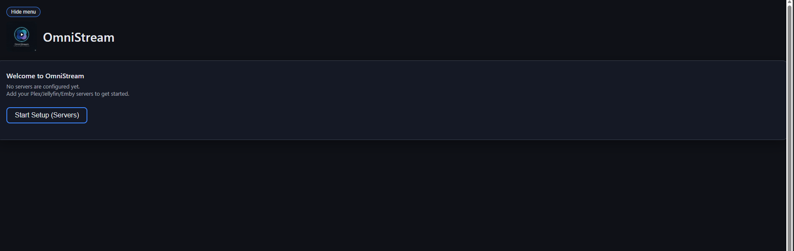
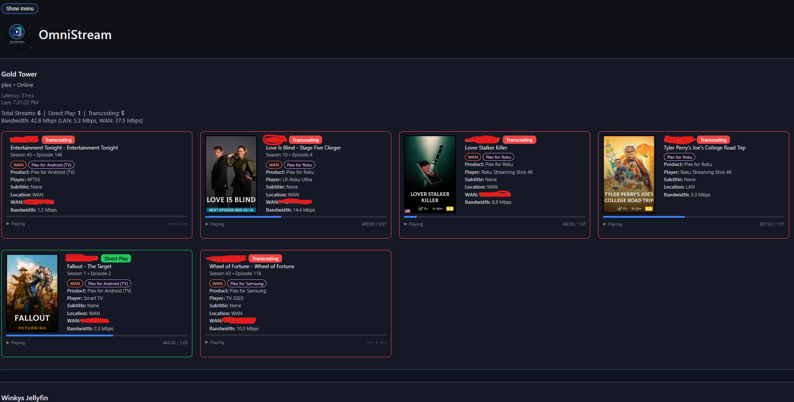
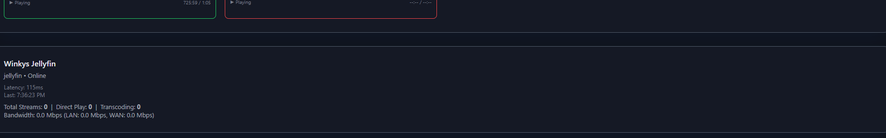
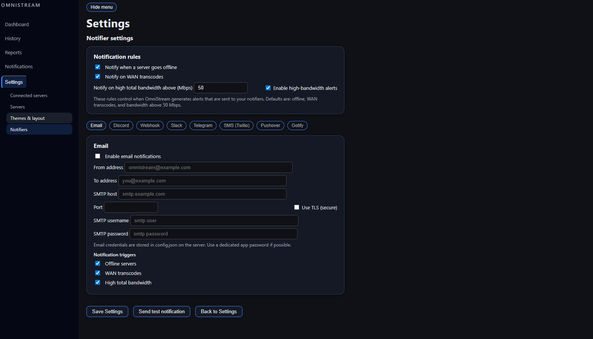
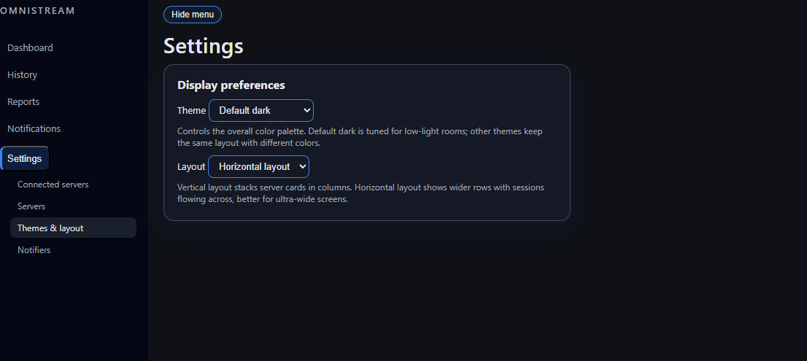

# OmniStream

_Read-only monitoring for Plex, Jellyfin, and Emby with history, reports, and notifications._

OmniStream is a dashboard to monitor multiple Plex, Jellyfin, and Emby servers on one screen. It shows active sessions, direct play vs transcoding, bandwidth usage, history, reports, and basic notifications.

## Quick start

- **Docker compose (recommended)**

	```bash
	# On your host
	mkdir -p /home/youruser/omnistream
	printf "[]\n" > /home/youruser/omnistream/servers.json

	# Optionally point SERVERS_PATH at your host file
	export SERVERS_PATH=/home/youruser/omnistream/servers.json

	# From the project root (where docker-compose.yml lives):
	docker compose up -d
	```

- **Local development (Node.js)**

	```bash
	npm install
	printf "[]\n" > servers.json
	node server.js
	```

## Features

- Monitor multiple media servers (Plex, Jellyfin, Emby)
- Per-server status (online/offline, latency)
- Live sessions with posters, media details, and progress
- Direct Play vs Transcoding highlighting
- History and basic reports
- Admin UI to add/edit/enable/disable servers
- Simple notifications (offline servers, WAN transcodes, high bandwidth)

---
## What OmniStream does (and doesn't) do

- **Read-only monitoring** &mdash; OmniStream never modifies your media libraries or playback; it only calls the official Plex/Jellyfin/Emby APIs to read status.
- **No library management** &mdash; it does not add/remove media, manage metadata, or control your players.
- **Focused on visibility** &mdash; the goal is a clear view of sessions, bandwidth, and health across servers, plus basic alerts.

---
## Screenshots

### Setup



### Dashboard




### Servers


### Notifiers



### Themes




## Running with Docker (recommended)

The published image is:

- `ghcr.io/winky2000/omnistream:latest`

### 1. Create a config directory and servers.json on the host

```bash
mkdir -p /home/youruser/omnistream
printf "[]\n" > /home/youruser/omnistream/servers.json
```

> Important: `servers.json` on the host must be a **regular file**, not a directory. Docker will create a directory if the file does not exist when you first mount it.

### 2. Run with docker-compose

The root `docker-compose.yml` is already wired to the published image and supports an overridable path for `servers.json` via `SERVERS_PATH`:

```yaml
services:
	omnistream:
		image: ghcr.io/winky2000/omnistream:latest
		container_name: omnistream
		restart: unless-stopped
		ports:
			- "3000:3000"
		environment:
			- NODE_ENV=production
		volumes:
			- ${SERVERS_PATH:-./servers.json}:/usr/src/app/servers.json
			# Optional: override bundled UI with local files
			# - ./public:/usr/src/app/public:ro
```

From the project root:

```bash
# Optionally point SERVERS_PATH at your host file
export SERVERS_PATH=/home/youruser/omnistream/servers.json

docker compose up -d
```

Then open:

- http://localhost:3000

### 3. Run with plain docker

```bash
mkdir -p /home/youruser/omnistream
printf "[]\n" > /home/youruser/omnistream/servers.json

docker run -d \
	--name omnistream \
	-p 3000:3000 \
	-v /home/youruser/omnistream/servers.json:/usr/src/app/servers.json \
	-e NODE_ENV=production \
	ghcr.io/winky2000/omnistream:latest
```

---

## First-time setup

1. Start the container.
2. Open http://localhost:3000.
3. You will see a welcome card if no servers are configured.
4. Click **Start Setup (Servers)** or go to the **Admin → Servers** tab.
5. Add your servers:
	 - **Name**: Friendly name.
	 - **Base URL**:
		 - Plex: e.g. `http://192.168.1.138:32400`
		 - Jellyfin: e.g. `http://192.168.1.138:8096`
		 - Emby: your Emby URL + port.
	 - **Type**: `plex`, `jellyfin`, or `emby`.
	 - **Token**:
		 - Plex: X-Plex token.
		 - Jellyfin/Emby: API key from the server dashboard.

OmniStream writes your server changes back to `servers.json` inside the container. With a bind mount, that updates the host file as well.

---

## Local development (Node.js)

If you want to run directly with Node instead of Docker:

1. Install dependencies:

```bash
npm install
```

2. Create a `servers.json` in the project root:

```bash
printf "[]\n" > servers.json
```

3. Start the server:

```bash
node server.js
```

Open http://localhost:3000 and add servers via the Admin UI.

---

## Notifications

OmniStream can send basic alerts when something important happens.

- **Channels**: Discord, generic webhook, Slack, Telegram, SMS (Twilio), Pushover, Gotify, and Email.
- **Events** (global rules):
	- Offline servers
	- WAN transcodes
	- High total bandwidth above a configurable Mbps threshold
- **Per-channel triggers**: each notifier (e.g. Discord vs SMS) can opt in/out of specific events on the Notifiers page.
- **Test button**: use **Send test notification** on the Notifiers page to confirm your configuration without waiting for a real event.

---

## History, reports, and per-server views

OmniStream keeps a lightweight history of what has been playing across your servers and builds reports from that.

- **History storage**
	- Stored in `history.db` (SQLite) in the app directory.
	- By default, OmniStream keeps the most recent 500 entries to avoid unbounded growth.
	- You can change this via `config.json` using `maxHistory`:
		- `maxHistory: 500` (default) – keep at most 500 rows.
		- `maxHistory: 0` or any value `< 0` – disable automatic trimming and keep full history.
	- When trimming is disabled, history grows over time and is retained across restarts (as long as `history.db` is persisted).

- **How reports count plays**
	- The **Reports** page does not count every raw poll row as a separate play.
	- Instead, it collapses repeated samples into approximate **play events** to avoid over-counting long sessions.
	- A new event is counted when a `(user, title)` pair has been idle for 30 minutes or more and then appears again.
	- All top users/titles, last 24h/7d counts, busiest day, and peak hour metrics are based on these deduplicated events.

- **Per-server reports**
	- At the top of the **Reports** page there is a **Scope** dropdown.
	- Choose **All servers** to see aggregate activity across every enabled server.
	- Choose a specific server to filter:
		- Current streams
		- Unique play events (recent)
		- Plays last 24 hours and last 7 days
		- Busiest day and peak hour
		- Top titles and top users
	- The note next to the dropdown confirms which server (or all servers) you are currently viewing.

- **Importing server-side watch history**
	- The **Import history** action calls `POST /api/import-history` to pull past plays from your media servers.
	- **Jellyfin / Emby**: imports played Movies and Episodes per user (ignores library folders/views) and writes them into `history.db`.
	- **Plex**: imports recent watch history from Plex's history endpoint and writes Movie/Episode plays into `history.db`.
	- Imported rows are treated the same as live history; they affect the History page and all Reports metrics.
	- If you want to keep everything your servers report, set `maxHistory` to `0` before importing so OmniStream does not trim older rows.

---

## Running on unRAID

An example unRAID Docker template is provided at:

- `unraid/omnistream.xml`

### Template overview

- **Repository**: `ghcr.io/winky2000/omnistream:latest`
- **Network type**: `bridge`
- **WebUI**: `http://[IP]:[PORT:3000]/`
- **Port**:
	- Container port `3000` mapped to a host port (defaults to `3000`).
- **Volume**:
	- Host path: `/mnt/user/appdata/omnistream/servers.json`
	- Container path: `/usr/src/app/servers.json`
	- Mode: `rw`
	- Description: `Path to servers.json on the array/cache. The file is created/updated by OmniStream.`
- **Environment**:
	- `NODE_ENV=production`

### Importing the template

1. Copy `unraid/omnistream.xml` from this repo to your unRAID box under:

	- `/boot/config/plugins/dockerMan/templates-user/`

2. In the unRAID web UI, go to **Docker → Add Container**.
3. In the **Template** drop-down, choose **OmniStream**.
4. Adjust if needed:
	- Host port for the WebUI (if `3000` is already in use).
	- Host path for `servers.json` if you prefer a different appdata location.
5. Apply to create and start the container, then open the WebUI.

---

## Configuration at a glance

| Item                         | Location / file                           | Description                                           |
|------------------------------|-------------------------------------------|-------------------------------------------------------|
| Server list                  | `servers.json`                            | List of Plex/Jellyfin/Emby servers and tokens.       |
| Notifier & advanced config   | `config.json`                             | Created/updated when you save Notifier settings.     |
| History database             | `history.db`                              | SQLite DB storing recent session snapshots.          |
| Docker compose definition    | `docker-compose.yml`                      | Recommended way to run the container.                |
| unRAID template              | `unraid/omnistream.xml`                   | Example template for unRAID Docker manager.          |

---

## Server config format

Each server entry uses this shape (fields with defaults are optional):

```json
{
	"id": "plex-1",
	"name": "Gold Tower",
	"type": "plex",        // "plex" | "jellyfin" | "emby"
	"baseUrl": "http://192.168.1.138:32400",
	"token": "...",
	"enabled": true
}
```

Optional fields (normally filled in by the app):

- `tokenLocation` — defaults to `query` for Plex, `header` for Jellyfin/Emby.
- `apiPath` — defaults to `/status/sessions` (Plex) or `/Sessions` (Jellyfin/Emby).

You can edit servers via the Admin → Servers UI rather than hand-editing `servers.json`.

---

## Troubleshooting

- **EISDIR: illegal operation on a directory, open '/usr/src/app/servers.json'**
	- The host path in your volume mapping points to a **directory** named `servers.json`.
	- Fix by deleting that directory, recreating a file with `[]`, and restarting the container.

- **Permission denied writing servers.json**
	- Ensure the host file is writable by the Docker user, e.g.:
		- `chown youruser:youruser /home/youruser/omnistream/servers.json`
		- `chmod 664 /home/youruser/omnistream/servers.json`

- **Jellyfin shows offline / 401**
	- Confirm `baseUrl` and port are correct (e.g. `http://192.168.1.138:8096`).
	- Use a valid API key; OmniStream sends it using the expected Jellyfin headers/query.

Once servers are online, the main dashboard shows live sessions, and the Admin tabs (Servers, Reports, Notifications, History) provide management and insights.

---

## Releases

### v0.1.0

Initial public release of OmniStream:

- Multi-server dashboard for Plex, Jellyfin, and Emby with active session cards and bandwidth stats.
- Per-server status, history storage, and a simple reports view (top users/titles, 7-day activity).
- Read-only monitoring with support for multiple notifier channels and basic rules.
- New sidebar-driven UI with Settings subpages, themes/layout selection, and Notifiers test button.

---
## Contributing

Contributions and feedback are welcome.

- For small fixes (typos, wording, minor UI tweaks), feel free to open a pull request directly.
- For larger changes, please open an issue first so we can discuss the approach.
- When adding user-visible changes, update:
	- `README.md` where appropriate.
	- `CHANGELOG.md` with a brief entry under the **Unreleased** section (or the next version).


## TODO / ideas

- **Reports**
	- Per-user weekly/monthly watch time.
	- Per-server bandwidth trend charts.
- **Notifications**
	- More granular rules (per-user, per-library, per-location).
	- Built-in templates for Discord/email messages.
- **UI/UX**
	- Optional compact/mobile layout.
	- Icon-based client badges for popular players.
- **Technical**
	- More tests around history import and notifiers.
	- Configurable polling interval and history retention.

